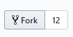

# Capstone Project - E-Wallet API

You know what is this.

## Getting Started

1. Register an account on [Github](https://github.com/) if haven't do so.
2. Go to learn how to use Git and Github
  * If you prefer reading, go to [this](https://guides.github.com/introduction/git-handbook/)
  * If you prefer watching video go to [this](https://www.youtube.com/githubguides)
  * To try out practically, go to [this](https://guides.github.com/activities/hello-world/)
  * To learn how to really contribute to this project, go to [this](https://github.com/firstcontributions/first-contributions)

3. Login and Fork this project. Click the button on top.
.

### Prerequisites

1. Install [composer](https://getcomposer.org/download/)
2. Install [NPM](https://nodejs.org/en/download/)
3. Install [XAMPP](https://www.apachefriends.org/download.html) or [PHP](https://www.php.net/downloads.php)
4. Install [Github Desktop](https://desktop.github.com/)

### Installing

```
git clone https://github.com/samueltan3972/EWallet-API.git
```

Then run the install_script.bat by double click it

or

```
cd [to the directory you wish to download the file]
git clone https://github.com/samueltan3972/EWallet-API.git
cd EWallet-API
composer install
copy .env.example .env
php artisan key:generate
```

## Serve the application

```
composer serve
```

Then start your browser with localhost:8000

## Built With

* [Laravel](https://laravel.com/docs/5.8) - The web framework used
